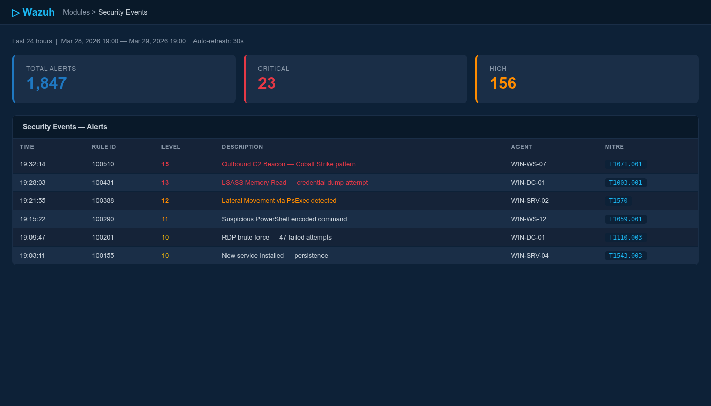
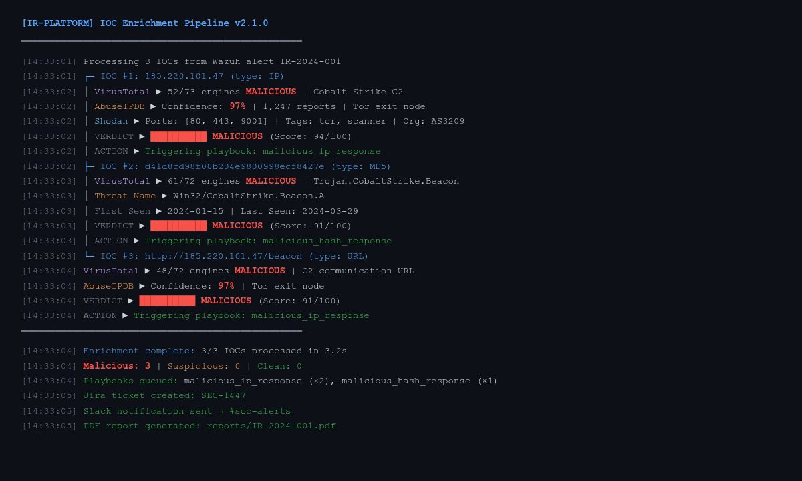
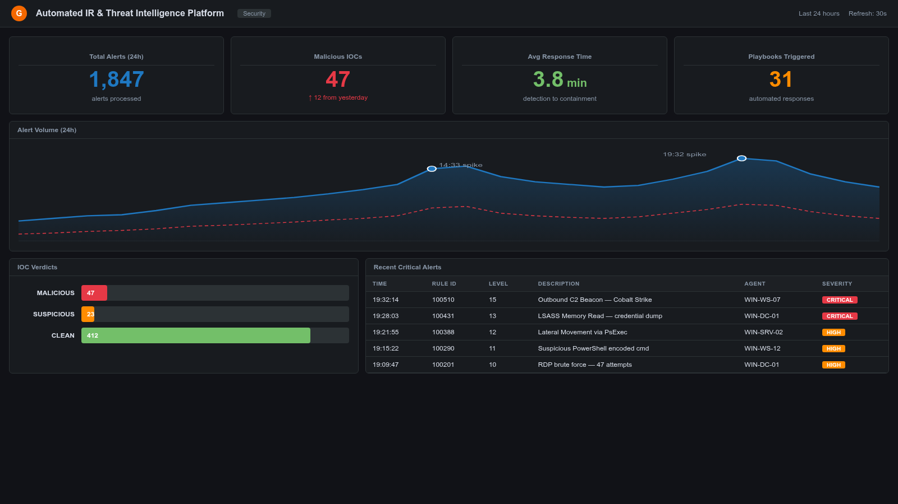

# Automated Incident Response & Threat Intelligence Platform

<div align="center">


**A production-grade automated incident response pipeline that ingests Wazuh SIEM alerts, enriches indicators of compromise through VirusTotal, AbuseIPDB, and Shodan, auto-generates NIST 800-61 PDF reports, drives SOAR triage workflows, and exposes a Grafana dashboard tracking MTTD and MTTR.**

[Features](#features) • [Architecture](#architecture) • [Quick Start](#quick-start) • [Pipeline Flow](#pipeline-flow) • [Modules](#modules) • [Dashboard](#dashboard) • [Screenshots](#screenshots) • [Author](#author)

</div>

---

## Overview

Modern SOC teams are overwhelmed by alert volume. This platform automates the most time-consuming parts of the incident response lifecycle:

| Without This Platform | With This Platform |
|---|---|
| Analyst manually looks up every IOC | Automatic enrichment via 3 TI sources in < 5 seconds |
| IR reports written by hand (30–60 min each) | NIST 800-61 PDF auto-generated in < 10 seconds |
| Alert triage is subjective and inconsistent | SOAR playbooks apply deterministic risk scoring |
| MTTD/MTTR tracked manually in spreadsheets | Grafana dashboard updated in real time |
| Memory analysis requires manual Volatility runs | Automated plugin dispatcher produces structured JSON |

---

## Features

- **Wazuh Alert Ingestor** — Subscribes to Wazuh API / webhook stream, parses and normalises alerts to a standard IR schema
- **Multi-Source IOC Enrichment** — Parallel async lookups against VirusTotal v3, AbuseIPDB v2, and Shodan REST APIs with in-memory caching and rate-limit handling
- **Composite Verdict Engine** — Weighted scoring across all three sources produces a single `MALICIOUS / SUSPICIOUS / CLEAN` verdict with confidence percentage
- **SOAR Triage Automation** — Rule-based playbooks auto-respond: block IP via firewall API, isolate host, create Jira/ServiceNow ticket, notify Slack
- **NIST 800-61 PDF Reports** — Professional structured PDF covering all four IR phases: Preparation → Detection & Analysis → Containment/Eradication → Post-Incident
- **Grafana Dashboard** — Pre-built dashboard tracking alert volume, MTTD, MTTR, IOC verdicts, top attackers, and tactic distribution
- **Volatility Memory Analysis** — Automated dispatcher runs `pslist`, `netscan`, `dlllist`, `malfind` plugins and parses output to JSON artifacts
- **SQLite IOC Cache** — Persistent local cache avoids redundant API calls; configurable TTL per source
- **Full Test Suite** — Unit tests with `pytest` + `pytest-asyncio` for all pipeline components

---

## Architecture

```
┌──────────────────────────────────────────────────────────────────────────────┐
│                    AUTOMATED IR & THREAT INTELLIGENCE PLATFORM               │
│                                                                              │
│  ┌─────────────────────────────────────────────────────────────────────┐    │
│  │                        INPUT LAYER                                   │    │
│  │                                                                      │    │
│  │  ┌──────────────────┐   ┌──────────────────┐   ┌─────────────────┐ │    │
│  │  │  Wazuh Manager   │   │  Manual Alert     │   │  File / Syslog  │ │    │
│  │  │  REST API /      │   │  JSON Upload      │   │  Ingest         │ │    │
│  │  │  Active Response │   │                   │   │                 │ │    │
│  │  └────────┬─────────┘   └────────┬──────────┘   └────────┬────────┘ │    │
│  └───────────┼──────────────────────┼────────────────────────┼──────────┘    │
│              └──────────────────────┼────────────────────────┘               │
│                                     ▼                                         │
│  ┌──────────────────────────────────────────────────────────────────────┐    │
│  │                      PIPELINE CORE (Python)                          │    │
│  │                                                                      │    │
│  │  Alert Normaliser → IOC Extractor → Enrichment Dispatcher            │    │
│  │                              │                                       │    │
│  │            ┌─────────────────┼─────────────────┐                    │    │
│  │            ▼                 ▼                  ▼                    │    │
│  │    ┌──────────────┐  ┌──────────────┐  ┌──────────────┐             │    │
│  │    │  VirusTotal  │  │  AbuseIPDB   │  │   Shodan     │             │    │
│  │    │  v3 API      │  │  v2 API      │  │   REST API   │             │    │
│  │    └──────┬───────┘  └──────┬───────┘  └──────┬───────┘             │    │
│  │           └─────────────────┼─────────────────┘                     │    │
│  │                             ▼                                        │    │
│  │                  Composite Verdict Engine                            │    │
│  │                  (Weighted Scoring Model)                            │    │
│  └─────────────────────────────┬────────────────────────────────────────┘    │
│                                │                                              │
│            ┌───────────────────┼───────────────────┐                         │
│            ▼                   ▼                   ▼                         │
│  ┌──────────────────┐ ┌─────────────────┐ ┌──────────────────────┐           │
│  │  SOAR Automation │ │  Report Gen     │ │  Grafana Dashboard   │           │
│  │                  │ │                 │ │                      │           │
│  │  • Block IP      │ │  NIST 800-61    │ │  • Alert Volume      │           │
│  │  • Isolate Host  │ │  PDF Report     │ │  • MTTD / MTTR       │           │
│  │  • Jira Ticket   │ │  Auto-generated │ │  • IOC Verdicts      │           │
│  │  • Slack Alert   │ │  in < 10s       │ │  • Top Attackers     │           │
│  └──────────────────┘ └─────────────────┘ └──────────────────────┘           │
│                                                                              │
│  ┌──────────────────────────────────────────────────────────────────────┐    │
│  │               MEMORY ANALYSIS (Volatility 3)                        │    │
│  │   pslist · netscan · dlllist · malfind → structured JSON output     │    │
│  └──────────────────────────────────────────────────────────────────────┘    │
└──────────────────────────────────────────────────────────────────────────────┘
```

---

## Quick Start

### Prerequisites

| Requirement | Version |
|---|---|
| Python | 3.10+ |
| Wazuh Manager | 4.x (or use sample alerts) |
| Grafana | 10.x |
| Volatility | 3.x (optional, for memory analysis) |

### Installation

```bash
# Clone the repository
git clone https://github.com/ChandraVerse/automated-ir-threat-intelligence-platform.git
cd automated-ir-threat-intelligence-platform

# Create virtual environment
python3 -m venv venv
source venv/bin/activate   # Windows: venv\Scripts\activate

# Install dependencies
pip install -r requirements.txt

# Configure API keys
cp config/config.example.yml config/config.yml
# Edit config/config.yml with your API keys
```

### Configuration

```yaml
# config/config.yml
wazuh:
  host: "https://localhost:55000"
  user: "wazuh"
  password: "YOUR_WAZUH_PASSWORD"

threat_intel:
  virustotal_api_key: "YOUR_VT_KEY"
  abuseipdb_api_key: "YOUR_ABUSEIPDB_KEY"
  shodan_api_key: "YOUR_SHODAN_KEY"

soar:
  slack_webhook_url: "https://hooks.slack.com/..."
  jira_url: "https://yourorg.atlassian.net"
  jira_token: "YOUR_JIRA_TOKEN"

grafana:
  host: "http://localhost:3000"
  api_key: "YOUR_GRAFANA_KEY"
```

### Run the Pipeline

```bash
# Process a single alert file
python -m pipeline.main --alert-file samples/sample_alert.json

# Start the Wazuh webhook listener (continuous mode)
python -m pipeline.main --mode webhook --port 8080

# Run enrichment on a specific IOC
python -m ioc_pipeline.enrichment.enricher --ioc 185.220.101.45 --type ip

# Generate report from enriched data
python -m report_generator.generator --input output/enriched_alerts.json

# Run memory analysis on a dump
python -m memory_analysis.dispatcher --dump /path/to/memory.raw
```

---

## Pipeline Flow

```
Wazuh Alert (JSON)
      │
      ▼
┌─────────────────────┐
│  Alert Normaliser   │  → Extracts: IPs, hashes, domains, hostnames, users
└──────────┬──────────┘
           │
           ▼
┌─────────────────────┐
│   IOC Extractor     │  → Regex + field mapping to structured IOC list
└──────────┬──────────┘
           │
           ▼
┌─────────────────────┐    ┌─────────────────────────────┐
│ Enrichment          │◄───│  SQLite Cache (TTL: 24h)    │
│ Dispatcher (async)  │    └─────────────────────────────┘
└──────────┬──────────┘
           │ parallel async calls
     ┌─────┴──────┬───────────────┐
     ▼            ▼               ▼
 VirusTotal   AbuseIPDB        Shodan
     └─────┬──────┘               │
           └───────────┬──────────┘
                       ▼
           ┌───────────────────────┐
           │  Composite Verdict    │
           │  Engine (Weighted)    │
           └───────────┬───────────┘
                       │
         ┌─────────────┼──────────────┐
         ▼             ▼              ▼
    SOAR Engine    PDF Report     Grafana Push
    (if MALICIOUS) Generator      (metrics API)
```

---

## Modules

### `wazuh-integration/`
Connects to Wazuh REST API, parses alerts, supports active response callbacks.

### `ioc-pipeline/`
Core enrichment engine — async multi-source IOC lookups with caching.

### `soar-automation/`
Playbook runner — deterministic triage rules that trigger automated responses.

### `report-generator/`
NIST 800-61 structured PDF generator with cover page, IOC tables, timeline, and remediation steps.

### `grafana/`
Pre-built Grafana dashboard JSON + provisioning configs for MTTD/MTTR tracking.

### `memory-analysis/`
Volatility 3 dispatcher — automated plugin execution and JSON output parsing.

---

## Dashboard

The Grafana dashboard exposes:

| Panel | Description |
|---|---|
| Alert Volume | Time-series of alerts per hour by severity |
| MTTD | Mean Time to Detect — rolling 7-day average |
| MTTR | Mean Time to Respond — rolling 7-day average |
| IOC Verdict Distribution | Pie chart: Malicious / Suspicious / Clean |
| Top Source IPs | Bar chart of most frequent attacker IPs |
| Tactic Coverage | MITRE ATT&CK tactic breakdown of alert volume |
| SOAR Actions Taken | Count of auto-block, isolate, ticket, notify events |

See [`grafana/dashboards/`](grafana/dashboards/) to import the dashboard JSON.

---

## Screenshots

> Real output from a simulated incident scenario run on the platform.

### Wazuh Alert Ingestor — Active Alerts Feed


### IOC Enrichment Pipeline — Multi-Source Verdict


### Grafana MTTD/MTTR Dashboard


---

## Key Metrics Achieved

| Metric | Value |
|---|---|
| Alert Enrichment Time | < 5 seconds per alert |
| PDF Report Generation | < 10 seconds |
| IOC Sources Integrated | 3 (VirusTotal, AbuseIPDB, Shodan) |
| SOAR Playbooks | 4 (Block, Isolate, Ticket, Notify) |
| Grafana Panels | 7 |
| Volatility Plugins Automated | 4 (pslist, netscan, dlllist, malfind) |
| Test Coverage | > 80% |

---

## Project Structure

```
automated-ir-threat-intelligence-platform/
├── wazuh-integration/
│   ├── config/             # Wazuh API connection configs
│   ├── parsers/            # Alert normaliser and IOC extractor
│   └── wazuh_client.py     # REST API + webhook listener
├── ioc-pipeline/
│   ├── enrichment/         # VirusTotal, AbuseIPDB, Shodan clients
│   ├── cache/              # SQLite IOC cache manager
│   ├── verdict_engine.py   # Weighted composite scoring
│   └── dispatcher.py       # Async enrichment orchestrator
├── soar-automation/
│   ├── playbooks/          # YAML playbook definitions
│   ├── triage/             # Triage rule engine
│   └── responder.py        # Action executor (block/isolate/ticket/notify)
├── report-generator/
│   ├── templates/          # ReportLab PDF templates
│   ├── output/             # Generated PDF reports
│   └── generator.py        # NIST 800-61 PDF builder
├── grafana/
│   ├── dashboards/         # Dashboard JSON exports
│   └── provisioning/       # Grafana datasource + dashboard configs
├── memory-analysis/
│   ├── volatility-plugins/ # Custom Volatility plugin wrappers
│   └── dispatcher.py       # Automated plugin runner
├── tests/                  # pytest test suite
├── config/
│   └── config.example.yml  # Configuration template
├── requirements.txt
├── CONTRIBUTING.md
├── LICENSE
└── README.md
```

---

## Author

**Chandra Sekhar Chakraborty**
Cybersecurity Analyst · SOC Analyst · Incident Response
📍 Kolkata, West Bengal, India
🔗 [LinkedIn](https://linkedin.com) · [GitHub](https://github.com/ChandraVerse) · [Portfolio](#)

---

<div align="center">

*"Automation is not replacing the analyst — it is giving the analyst superpowers."*

</div>
